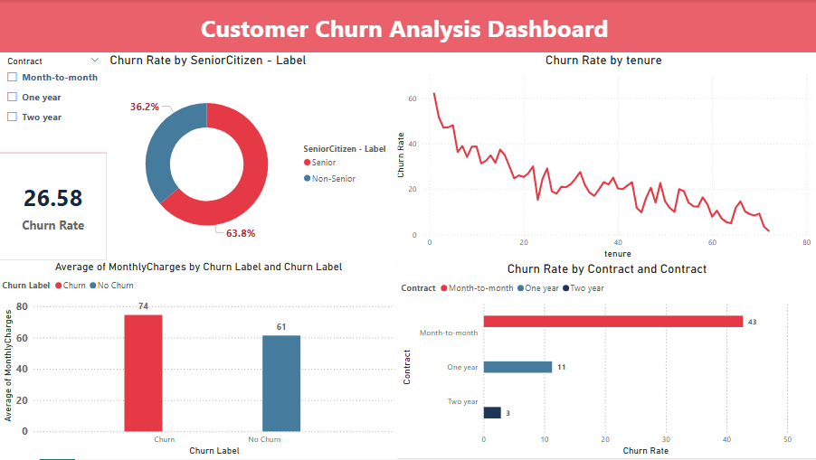
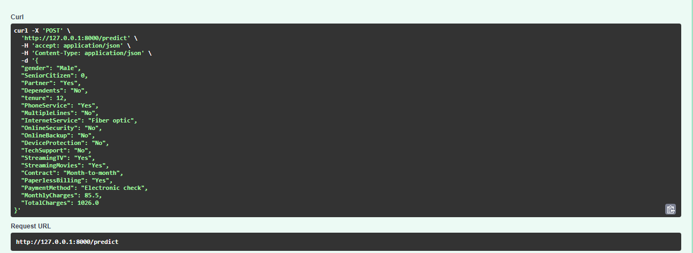

# Customer Churn Prediction System

An end-to-end machine learning project that predicts whether a telecom customer 
is likely to churn using an Artificial Neural Network (ANN) built with PyTorch.

Built on the IBM Telco Customer Churn dataset (7,043 customers, 21 features).
Achieved 87.42% accuracy.

## Tech Stack

- **PostgreSQL** — Raw data storage
- **Python** — Data preprocessing and model training
- **PyTorch** — Building and training the ANN model
- **FastAPI** — REST API for serving predictions
- **MongoDB** — Logging prediction results
- **Power BI** — Interactive dashboard and data visualization

## Architecture

PostgreSQL → Python → PyTorch → FastAPI → MongoDB → Power BI

- **PostgreSQL** — Stores raw customer data loaded from CSV
- **Python** — Preprocesses data using Pandas and Scikit-learn
- **PyTorch** — Trains the ANN model, saves model and scaler
- **FastAPI** — Serves predictions via REST API endpoints
- **MongoDB** — Logs every prediction with customer data and timestamp
- **Power BI** — Visualizes churn patterns through an interactive dashboard

## Project Structure

```
churn-prediction-system/
├── data/
│   ├── telco_churn.csv
│   └── load_data.py
├── model/
│   ├── preprocess.py
│   ├── train.py
│   ├── churn_model.pth
│   └── scaler.pkl
├── api/
│   └── main.py
├── screenshots/
│   ├── powerbi_dashboard.png
│   └── swagger_ui.png
├── .env
├── .gitignore
└── README.md
```


## Model Performance

- **Algorithm** — Artificial Neural Network (ANN)
- **Architecture** — 30 → 40 → 20 → 1 (ReLU, Sigmoid)
- **Accuracy** — 87.42%
- **Epochs** — 300
- **Observation** — Model begins to overfit beyond 300 epochs

## Screenshots

### Power BI Dashboard


### Swagger UI



### Streamlit UI


## How to Run Locally

1. Clone the repository
git clone https://github.com/MohomedShajith/churn-prediction-system.git
cd churn-prediction-system

2. Create and activate virtual environment
python -m venv venv
venv\Scripts\activate

3. Install dependencies
pip install -r requirements.txt

4. Create a `.env` file in the project root with the following variables
DB_USER=your_postgres_user
DB_PASSWORD=your_postgres_password
DB_HOST=localhost
DB_PORT=5432
DB_NAME=churndb
MONGO_URI=your_mongodb_atlas_uri

5. Run the API
uvicorn api.main:app --reload

6. Open Swagger UI at `http://127.0.0.1:8000/docs`
